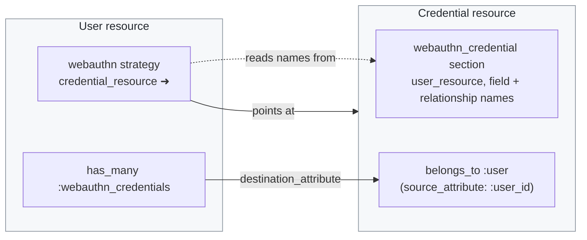
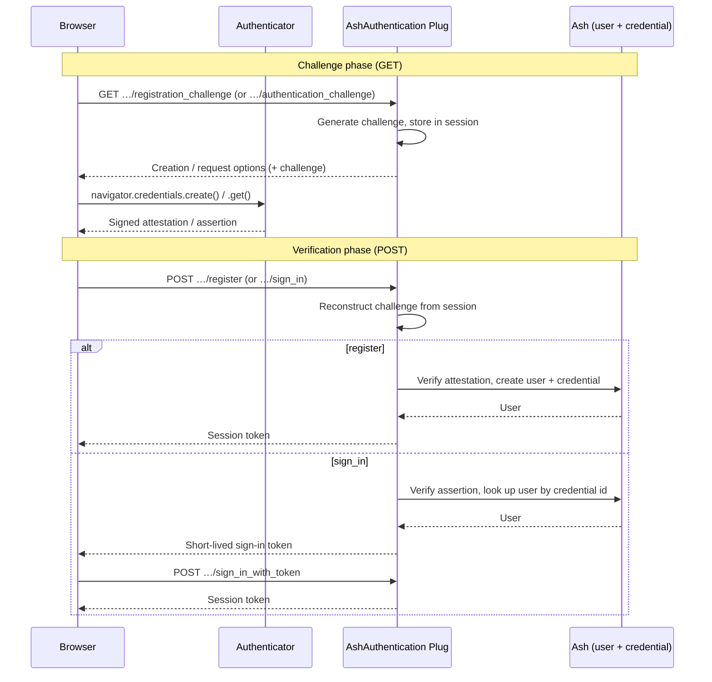

<!--
SPDX-FileCopyrightText: 2026 Alembic Pty Ltd

SPDX-License-Identifier: MIT
-->

# WebAuthn (Passkeys) Tutorial

The WebAuthn strategy authenticates users with FIDO2 hardware security keys
and passkeys — phishing-resistant, public-key credentials verified by the
browser and authenticator rather than a shared secret.

## Prerequisites

- AshAuthentication configured with a User resource
- The optional [`wax_`](https://hex.pm/packages/wax_) dependency:

  ```elixir
  {:wax_, "~> 0.7"}
  ```

- Tokens enabled (WebAuthn sign-in issues a token on success)

## Setup

Create a credential resource using the `AshAuthentication.WebAuthnCredential`
extension. It scaffolds the required attributes, relationship, identity, and
actions for you:

> #### The extension is required {: .info}
>
> As of 5.0 the credential resource must use this extension. Its
> `webauthn_credential` section is the single place the credential's attribute
> names, its `belongs_to` to the user resource, and its action names are
> configured — the `webauthn` strategy reads them back from there rather than
> declaring its own copies.
>
> Support for a credential resource without the extension may return in a
> later minor version.

```elixir
defmodule MyApp.Accounts.WebAuthnCredential do
  use Ash.Resource,
    domain: MyApp.Accounts,
    data_layer: AshPostgres.DataLayer,
    extensions: [AshAuthentication.WebAuthnCredential]

  webauthn_credential do
    user_resource MyApp.Accounts.User
  end

  postgres do
    table "webauthn_credentials"
    repo MyApp.Repo
  end

  policies do
    bypass AshAuthentication.Checks.AshAuthenticationInteraction do
      authorize_if always()
    end
  end
end
```

Then add the strategy to your user resource:

```elixir
authentication do
  strategies do
    webauthn do
      credential_resource MyApp.Accounts.WebAuthnCredential
      rp_id "example.com"
      rp_name "My App"
      require_identity? true
    end
  end
end
```

Run `mix ash.codegen add_webauthn` to generate the migrations.

### How the two resources fit together

The credential resource's `webauthn_credential` section is the single source
of truth for the credential's shape: it names the attributes, and it names the
`belongs_to` back to the user. The strategy only points at the credential
resource (`credential_resource`) and reads those names back from it — it never
declares its own copies. On the user side, the strategy builds a matching
`has_many`; both ends meet on the credential's one foreign key.



If the user resource isn't named `User`, the generated `has_many` derives its
foreign key from that resource's name (`Account` ➜ `:account_id`), so the
credential's `belongs_to` has to be named to match — set
`user_relationship_name` on the `webauthn_credential` section and everything
else follows from it. `mix ash_authentication.add_strategy.webauthn` does this
for you.

> ### Migrating from a legacy U2F deployment? {: .warning}
>
> Security keys registered through the pre-WebAuthn **FIDO U2F** JavaScript
> API are scoped to a legacy *AppID* URL rather than a WebAuthn RP ID, and
> will **not** respond to challenges issued by this strategy. The WebAuthn
> `appid` extension — the compatibility bridge that lets U2F-era credentials
> keep working — is **not implemented** here. If you are migrating an
> existing user base to AshAuthentication and still have U2F-registered keys
> in circulation, those users must re-register their keys as WebAuthn
> credentials (e.g. via the `add_credential` flow after signing in with
> another factor). New deployments are unaffected: the U2F API was removed
> from browsers in 2022, so no new U2F credentials can exist.

All cryptographic ceremony work goes through a swappable backend adapter
(see `AshAuthentication.Strategy.WebAuthn.Adapter`). The default uses the
`wax_` library; you only need to care about this if you want to replace or
instrument the ceremony implementation:

```elixir
webauthn do
  adapter MyApp.CustomWebAuthnAdapter
  # ...
end
```

## Configuration modes

The strategy supports four distinct configurations. Pick the row that matches
your product and use its settings as a starting point.

| Mode | Key settings | User resource needs | How sign-in works |
|------|--------------|---------------------|-------------------|
| **Identity + passkey** (classic) | `require_identity? true` | An `identity_field` attribute (default `:email`), unique and writable | User supplies their identity; their credentials are offered via `allowCredentials` |
| **Passkey-first** (no identity column) | `require_identity? false`, `resident_key :required` | No identity attribute at all | Fully discoverable: the browser offers stored passkeys and the credential id resolves the user |
| **Second factor only** | `require_identity? true`, `sign_in_enabled? false`, `verify_enabled? true` | Another primary strategy (e.g. password) | The `verify` phase proves possession on top of an authenticated session, stamping `webauthn_verified_at` |
| **Multi-tenant** | `rp_id`/`rp_name`/`origin` as MFA tuples, 1-arity functions, or `AshAuthentication.Secret` modules | Same as the mode it combines with | Relying-party identity resolved per tenant at ceremony time |

### Identity + passkey

```elixir
webauthn do
  credential_resource MyApp.Accounts.WebAuthnCredential
  rp_id "example.com"
  rp_name "My App"
  identity_field :email
  require_identity? true
end
```

### Passkey-first

```elixir
webauthn do
  credential_resource MyApp.Accounts.WebAuthnCredential
  rp_id "example.com"
  rp_name "My App"
  require_identity? false
  resident_key :required
end
```

Since there is no identity to display, the client should pass a
`display_name` parameter with the registration challenge request — it becomes
the account name shown in the passkey picker. (This is distinct from the
credential's `label`, which names the individual key/device in your own UI.)

### Second factor

```elixir
webauthn do
  credential_resource MyApp.Accounts.WebAuthnCredential
  rp_id "example.com"
  rp_name "My App"
  require_identity? true
  sign_in_enabled? false
end
```

### Multi-tenant

```elixir
webauthn do
  credential_resource MyApp.Accounts.WebAuthnCredential
  rp_id {MyApp.WebAuthn, :rp_id_for_tenant, []}
  rp_name {MyApp.WebAuthn, :rp_name_for_tenant, []}
  origin {MyApp.WebAuthn, :origin_for_tenant, []}
  require_identity? true
end
```

> ### Origins and ports {: .warning}
>
> The WebAuthn origin is scheme + host + port. When unset, the origin is
> derived from the actual request; the static fallback `https://{rp_id}`
> omits the port, so set `origin "https://localhost:4001"` explicitly if you
> terminate ceremonies somewhere without request context in development.

## Attestation

By default the strategy uses `attestation "none"` — the right choice for
most consumer applications, where *which* authenticator model a user owns is
none of your business. The registration ceremony is fully verified either
way; attestation only concerns the authenticator's provenance.

For deployments that must only accept certain authenticators (e.g. corporate
policy requiring hardware-backed keys), tighten all three settings:

```elixir
webauthn do
  credential_resource MyApp.Accounts.WebAuthnCredential
  rp_id "example.com"
  rp_name "My App"
  require_identity? true

  attestation "direct"
  trusted_attestation_types [:basic, :attca]
  verify_trust_root? true
end
```

- `attestation` — what the client is asked to convey: `"none"`,
  `"indirect"` (anonymized allowed), `"direct"`, or `"enterprise"`
  (individually identifying; needs browser/authenticator support).
- `trusted_attestation_types` — which verified attestation types are
  accepted. The default (`[:none, :basic, :self, :uncertain]`) accepts
  everything a consumer flow produces; restricting to `[:basic, :attca]`
  refuses registrations that don't chain to a known root.
- `verify_trust_root?` — whether `packed`/`u2f` attestation statements are
  checked against trust anchors (`tpm` always is).

Verifying trust roots requires FIDO metadata, which is loaded by the
underlying `wax_` library. Enable the FIDO Alliance MDS3 service:

```elixir
config :wax_, update_metadata: true
```

or ship metadata statements yourself via `config :wax_, metadata_dir: :my_app`
(reads `priv/fido2_metadata/` of that application). Without metadata, keep
`verify_trust_root? false` and include `:uncertain` in the trusted types.

## Ceremony phases

Each strategy instance exposes these routes (paths are prefixed with the
subject name and strategy name, e.g. `/user/webauthn/...`):

| Phase | Method | Purpose |
|-------|--------|---------|
| `registration_challenge` | GET | Creation options for registering a new user |
| `register` | POST | Verify attestation, create user + credential |
| `authentication_challenge` | GET | Request options for signing in |
| `sign_in` | POST | Verify assertion, issue token |
| `sign_in_with_token` | POST | Exchange a short-lived sign-in token for a session |
| `verify_challenge` | GET | Request options for second-factor verification |
| `verify` | POST | Prove possession as a second factor |
| `add_credential_challenge` | GET | Creation options for enrolling another passkey |
| `add_credential` | POST | Attach a new credential to the authenticated user |

Every ceremony is the same two round trips: a GET that mints a challenge and
stashes it in the session, then a POST that verifies the authenticator's
signed response against that stored challenge. Registration and sign-in differ
only in what the POST does once verification passes — create a user and
credential, or issue a token.



The `verify` (second factor) and `add_credential` (enroll another passkey)
ceremonies follow the same challenge-then-verify shape; they differ only in
requiring an already-authenticated actor and in what the POST does on success.

## Feature matrix

Status of this strategy against the WebAuthn specification (Level 2/3). This
section is maintained as the implementation evolves.

### Registration ceremony

| Spec feature | Status | Notes |
|---|---|---|
| Attestation verification | ✅ | Via `Wax.register/3` |
| `rp` (id/name) | ✅ | Static or per-tenant |
| `user` (id/name/displayName) | ✅ | Random ≤64-byte handle for new users (no PII, per spec); stable, shared handle when adding credentials to an existing user. Persisted on the credential as `user_handle` |
| `pubKeyCredParams` | ✅ | ES256, EdDSA, ES384/512, PS256/384/512, RS256/384/512 in preference order |
| `excludeCredentials` | ✅ | The actor's credentials when adding a passkey; identity-matched credentials on registration in identity mode |
| `authenticatorSelection` (attachment, residentKey, userVerification) | ✅ | All configurable. Whether a credential actually ended up discoverable is captured via `credProps` (see Extensions) |
| Attestation conveyance | ✅ | `"none"`, `"indirect"`, `"direct"`, `"enterprise"`; accepted attestation types and trust-root verification configurable (see [Attestation](#attestation)) |
| `timeout` | ✅ | Configurable |

### Authentication ceremony

| Spec feature | Status | Notes |
|---|---|---|
| Assertion verification | ✅ | Via `Wax.authenticate/6` — origin, rpId, and user-verification checks |
| `allowCredentials` (identity-first) | ✅ | Per-user lookup by `identity_field` |
| Discoverable / username-less flow | ✅ | Empty `allowCredentials`; user resolved from the credential id |
| Passkey-first mode (no identity column) | ✅ | `require_identity? false` |
| `transports` hints | ✅ | Captured from the client at registration (sanitized against the spec-registered set), echoed in `allowCredentials` |
| Sign counter (clone detection) | ✅ | Enforced per §6.1.1; `sign_count_policy :reject` (default), `:log`, or `:ignore`. Synced passkeys (constant zero counters) are never flagged |
| Backup flags (BE/BS) | ✅ | Stored as `backup_eligible`/`backed_up`; backup state refreshed on every assertion |
| Conditional UI / autofill mediation | ⚠️ | Server-side compatible (empty `allowCredentials`); wiring is a client concern |

### Extensions

| Extension | Status |
|---|---|
| `credProps` | ✅ Requested at registration; the client-reported `rk` result is stored as `discoverable` on the credential (nullable — browsers may omit it) |
| `appid` (U2F migration) | ❌ Not planned |
| `prf`, `largeBlob`, `credProtect` | ❌ Not planned |

### Credential lifecycle

| Flow | Status |
|---|---|
| Register new user (incl. custom `register_action_accept` fields) | ✅ |
| Sign in + short-lived token exchange | ✅ |
| Second-factor / step-up verification | ✅ |
| Add additional passkeys to an existing user | ✅ |
| List / relabel / delete credentials (last-credential protection) | ✅ |
| `last_used_at` tracking | ✅ |

## Security defaults worth knowing

- `sign_count_policy :reject` — assertions whose signature counter did not
  increase are rejected as possible cloned authenticators. Use `:log` for a
  monitoring-only rollout.
- `user_verification "preferred"` — raise to `"required"` for step-up or
  high-security deployments.
- Deleting a user's last credential is refused, so an account with WebAuthn
  as its only strategy cannot lock itself out.
- Client-reported `transports` are sanitized against the spec-registered
  transport set before storage.
- Challenges are stored in the Plug session scoped per ceremony type and
  strategy, so a registration in one tab and a sign-in in another don't
  interfere, and a sign-in can never consume a registration challenge.

For the full option reference, see the
[WebAuthn DSL documentation](/documentation/dsls/DSL-AshAuthentication.Strategy.WebAuthn.md)
and the
[WebAuthnCredential DSL documentation](/documentation/dsls/DSL-AshAuthentication.WebAuthnCredential.md).
